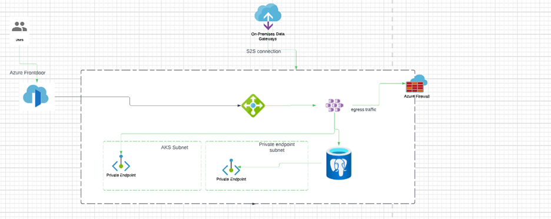

<!-- BEGIN_TF_DOCS -->
## Requirements

| Name | Version |
|------|---------|
|  [terraform](#requirement\_terraform) | 0.13.4 |

## Providers

No providers.

## Modules

| Name | Source | Version |
|------|--------|---------|
|  [aks](#module\_aks) | ./modules/aks | n/a |
|  [helm](#module\_helm) | ./modules/helm | n/a |
|  [networking](#module\_networking) | ./modules/networking | n/a |

## Resources

No resources.

## Inputs

| Name | Description | Type | Default | Required |
|------|-------------|------|---------|:--------:|
|  [name](#input\_name) | name variable for all naming resources | `string` | n/a | yes |

## Outputs

No outputs.
<!-- END_TF_DOCS -->

**ARCHITECTURE DIAGRAM:**

**Architecture Summary:**

To host the microsites and integration pipelines, we will deploy the following components using Terraform:

1. _Compute_: we'll set up the Azure Kubernetes Cluster (AKS) in the AKSsubnet without exposing it to the public. This decision was made because Kubernetes clusters are cloud-agnostic and can be used to run workloads on any public cloud and future proof architecture.
2. _Database_: I have chosen PAAS Private Azure PostgreSQL leverage the maintenance overhead like update and patching and it also available in all public cloud provider.
3. Load Balancer: I have architected with azure front door as load balancer since the requirement. employees are from global. AFD supports Web Application Firewall to prevent it from vulnerability like SQL injection etc.,
4. _Security_: Architected with private AKS cluster, Private Azure Postgressql and will have NSG on AKSSubnet level to deny the insecure traffic and Azure firewall to control the egress traffic both layer 4 and Layer 7.
5. _Security II_: I have architected with site 2 site connected to office onprem network. It will became the private site, it can only be accessed by employees who are connected to the office network
6. _CI_: I will choose the Jenkins as CI & CD solution. The Jenkins can be hosted in same AKS cluster and also, it's cost optimized and cloud agnostic solution.

